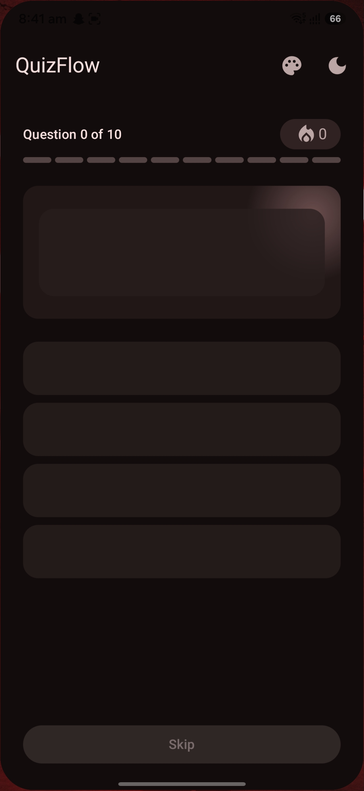
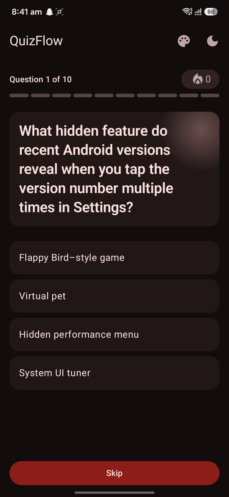
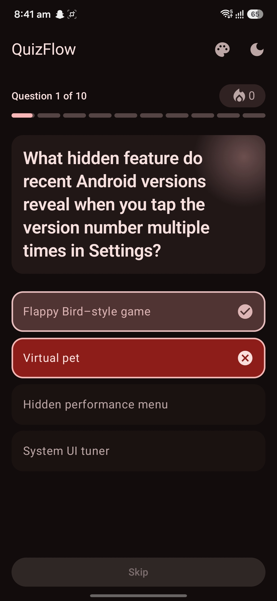
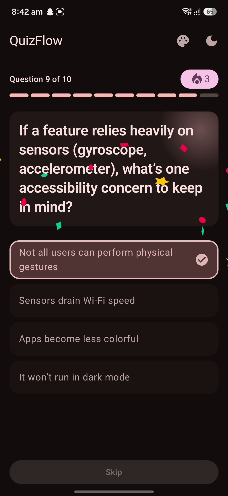
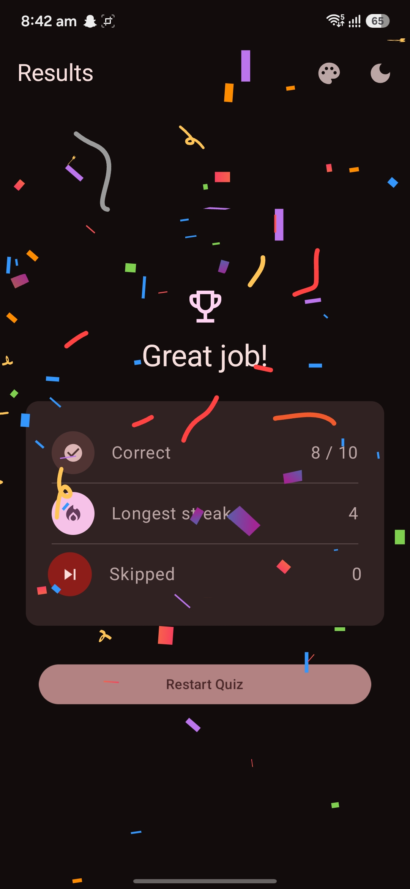
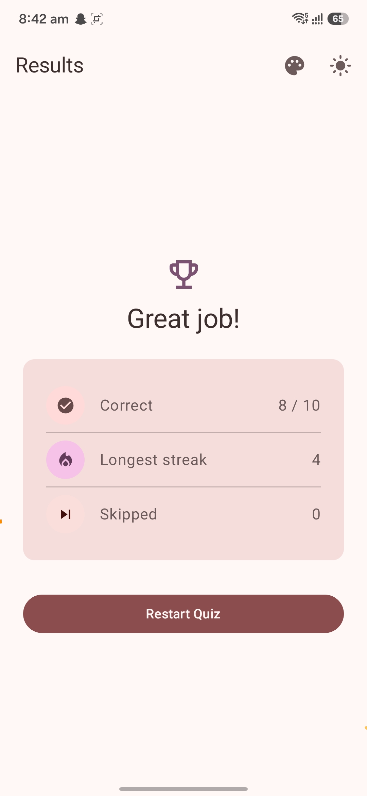

# QuizFlow

A polished, single-player **multiple-choice quiz** app built for the *R0 – MCQ Quiz* take-home
assignment. QuizFlow loads 10 questions from a remote JSON gist (with an offline fallback),
runs an animated quiz flow with answer reveal and streak tracking, and ends on a results screen
with a restart option.

Built to a deliberately high engineering bar — **Clean Architecture + MVVM + Repository pattern**,
a **pure-Kotlin domain layer**, **feature-sliced packages**, **Material 3 Expressive** theming
with dynamic color, and a broad test suite (150+ unit test methods across domain, data,
ViewModel, and Compose UI, plus on-device instrumented tests for real touch/gesture input).

---

## 📸 Screenshots

| Loading (shimmer) | Question | Answer revealed |
|---|---|---|
|  |  |  |

| Streak badge lit | Results | Light / Dark theme |
|---|---|---|
|  |  |  |

## 🎬 Full walkthrough video

A full end-to-end screen recording of the app (load → answer/skip through all 10 → streak →
results → restart, plus the theme/dynamic-color toggles) is available here:

**▶️ [Watch the demo video](https://drive.google.com/PLACEHOLDER_REPLACE_WITH_YOUR_LINK)**

> _Replace the link above with your Google Drive share link once the recording is uploaded
> (set sharing to "Anyone with the link → Viewer")._

---

## ✨ Features

- **Launch & load** — fetches 10 questions from the gist on start; a splash screen hands off to a
  **shimmer skeleton** that mirrors the quiz layout. Falls back to a bundled asset copy if the
  network is unavailable, and shows a typed **error state with Retry** on unrecoverable failures.
- **Quiz flow** — question text + 4 options, a **segmented per-question progress bar**, tap to
  reveal the correct answer and your selection (color **and** icon, not color alone), then a
  1-second reveal before auto-advancing.
- **Skip** — advances immediately with no reveal; also triggerable by **swiping left**.
- **Streak tracking** — a badge **lights up at 3 correct in a row** with a Lottie confetti
  micro-interaction; any wrong answer resets the streak.
- **Results** — Correct/Total, longest streak, and skipped count in a stat card with staggered
  reveal animations and a celebratory confetti + trophy on scores ≥ 80%.
- **Restart** — resets all counters and returns to question 1.
- **Theming** — Material 3 Expressive with a persisted **Light / Dark / System** toggle and a
  separate **dynamic (wallpaper) color** toggle on Android 12+, both DataStore-backed.
- **Accessibility** — semantic roles, state-specific content descriptions, a **polite live region**
  announcing correct/wrong on reveal, and edge-to-edge system-bar handling that tracks the theme.

---

## 🏗️ Architecture

Clean Architecture + MVVM + Repository pattern, **feature-sliced by package** inside a single
Gradle module (`:app`). See `docs/work/PRD.md` §5 for the full rationale.

```
com.shanu.quizflow
├── QuizFlowApplication.kt          @HiltAndroidApp
├── MainActivity.kt                 @AndroidEntryPoint; splash, edge-to-edge, hosts the Compose tree
├── core/                           cross-cutting infrastructure shared by every feature
│   ├── di/                         Hilt modules (network, dispatchers, DataStore, settings)
│   ├── network/                    Retrofit / OkHttp / kotlinx.serialization providers
│   ├── result/                     DataResult<T> (Success/Error) + AppError — the repo result wrapper
│   ├── coroutines/                 DispatcherProvider (injectable; swapped for TestDispatchers in tests)
│   ├── settings/                   theme + dynamic-color preference feature (domain/data/presentation)
│   └── ui/
│       ├── theme/                  Color, Type, Dimens (design tokens), Theme (Material3 Expressive)
│       └── components/             shared composables (top bar, toggles, streak badge, skip, etc.)
└── feature/quiz/
    ├── data/                       remote + local (asset) data sources, repository impl, DTO↔domain mappers
    ├── domain/                     pure Kotlin: Question/QuizSession/QuizResult models, use cases, repo interface
    └── presentation/               QuizViewModel + Navigation 3 host + Loading/Quiz/Results screens & components
```

### Layer rule

```
presentation ──▶ domain ◀── data
```

- **`domain` is pure Kotlin** — zero Android / Compose / Retrofit imports. This is what makes the
  streak/scoring/session logic trivially unit-testable without Robolectric.
- **`data`** implements the domain `QuizRepository` interface and owns DTOs, the API, mappers, and
  the network↔asset fallback.
- **`presentation`** depends only on `domain`. **ViewModels never touch a repository directly** —
  always through a use case (a standing convention for every feature).
- **DI (`core/di`, feature `di/`)** is the only place that knows all three layers.

### Key flows

- **State** — `QuizViewModel` owns an immutable `QuizSession` (single source of truth) and projects
  it into a `QuizUiState` sealed interface (`Loading` / `Error` / `Question` / `Finished`).
  Each user action runs a pure use case that returns a new session copy.
- **Reveal / auto-advance** — answering emits a `REVEALING` state and launches a *cancelable*
  coroutine that waits the injected reveal duration, then advances. Skipping cancels it and
  advances immediately.
- **Navigation** — Jetpack **Navigation 3** (`NavDisplay`) with a `Loading → Quiz → Results` back
  stack. The three screens share a single Activity-scoped `QuizViewModel`, so the session survives
  the transition to Results and a restart resets the same owner. `QuizFlowHost` carries a comment
  explaining exactly how this scoping resolves (and the caveat against adding a per-entry
  `ViewModelStore` decorator later, which would silently break it).

---

## 🧰 Tech stack

| Concern | Choice |
|---|---|
| Language / UI | Kotlin 2.2.10, Jetpack Compose, **Material 3 Expressive** |
| Architecture | Clean Architecture, MVVM, Repository, use-case-mediated ViewModels |
| Async | Coroutines + Flow (`StateFlow` for UI state) |
| DI | Hilt 2.59.2 (KSP) |
| Networking | Retrofit 3 + OkHttp 5 + kotlinx.serialization (JSON) |
| Navigation | Jetpack Navigation 3 |
| Persistence | DataStore Preferences (theme + dynamic-color prefs) |
| Animation | Compose animation APIs + Lottie |
| Build | AGP 9.3, `compileSdk 37`, `minSdk 29`, `targetSdk 36`, JVM 17, **R8 on for release** |
| Testing | JUnit4, coroutines-test, Turbine, MockK (fakes-first), Truth, Robolectric, Compose UI Test, Jacoco |

> **Note — bleeding-edge stack.** This project runs AGP 9.3, an **alpha** Compose BOM
> (`2026.06.01`, required for Material 3 Expressive), and recent Hilt/KSP. `compileSdk` is bumped
> to 37 to satisfy the alpha BOM. The specific compatibility issues hit and fixed are documented in
> `docs/work/PRD.md` §14 — verify changes with a real `./gradlew assembleDebug` rather than trusting
> version research alone.

---

## 🚀 Build & run

Requirements: Android Studio (AGP 9.3+), JDK 17+. From the repo root, use the Gradle **wrapper**
(never a system-installed `gradle`):

```bash
./gradlew assembleDebug         # build the debug APK
./gradlew assembleRelease       # build the release APK (R8/minify enabled)
./gradlew installDebug          # install debug on a connected device/emulator
adb shell am start -n com.shanu.quizflow/.MainActivity
```

There is no CLI "run" outside Android Studio — use `installDebug` + `adb`, or run from the IDE.

---

## ✅ Tests & coverage

```bash
./gradlew testDebugUnitTest     # unit + Robolectric Compose UI tests (app/src/test)
./gradlew lintDebug             # Android lint
./gradlew jacocoTestReport      # coverage → app/build/reports/jacoco/jacocoTestReport/html/index.html
./gradlew connectedAndroidTest  # instrumented tests (needs an emulator/device)
```

Run a single class:

```bash
./gradlew testDebugUnitTest --tests "com.shanu.quizflow.feature.quiz.presentation.quiz.QuizViewModelTest"
```

**What's tested** (fakes-first; MockK only where a fake is impractical):

| Layer | What's covered |
|---|---|
| **Domain** (models, use cases, session/streak/scoring logic) | Correct/wrong/skip transitions, streak reset & longest-streak preservation, restart, result tallies |
| **Data** (mapper, DTO serialization, repository, remote API, asset source) | Valid + malformed JSON, validation errors, network→asset fallback, error propagation, a real Retrofit+MockWebServer round-trip for the API call |
| **Presentation** (`QuizViewModel`, `QuizUiStateMapper`, `AppErrorMessage`) | Load success/error/retry, reveal → virtual-advance → next, skip cancels auto-advance, streak flag, finish & restart, `SavedStateHandle` progress persistence/restore (coroutines-test + Turbine) |
| **UI** (Compose via Robolectric, plus a couple of on-device instrumented tests) | Every screen + shared component: Loading/skeleton/error, Question render + tap/reveal/skip, progress bar segments, option states, streak badge, results stat rows, top bar + theme/dynamic-color toggles |

**Coverage** — run `./gradlew jacocoTestReport` and open
`app/build/reports/jacoco/jacocoTestReport/html/index.html` for current numbers; they aren't
pasted here because they drift every time a test or a source file changes and a stale number in a
README is worse than no number. Domain (models/use cases) and the mapper are exercised
exhaustively by design (every branch has a dedicated test — see the table above); the ViewModel
and every screen/component have direct tests. The intentionally lighter spots are thin wiring
(Hilt DI modules, the Nav3 host, `MainActivity`, `QuizFlowApplication`) — exercised in practice by
every other test, but not worth unit-testing in isolation.

### Continuous integration

`.github/workflows/ci.yml` runs on every PR and on push to `master`:
`testDebugUnitTest` + `lintDebug` + `assembleDebug`, with `assembleRelease` (R8) as a release gate.
All unit/Robolectric tests are part of the `testDebugUnitTest` gate, so the CI run is the source of
truth for "the tests pass."

---

## 🧭 Design decisions & assumptions

- **JSON source** — the raw gist (`gist.githubusercontent.com/dr-samrat/…/raw`), a JSON array of 10
  objects with `correctOptionIndex` as a **0-based** index. A bundled `assets/questions.json`
  mirror serves as an offline fallback and a stable test fixture. The mapper **validates** (exactly
  4 options, index in `0..3`) and fails with a typed error rather than crashing.
- **Reveal timing** — the correct/wrong state shows for **1 second** (the progress-bar segment
  fills over exactly that second) before auto-advancing. The spec suggested 2 s; the shorter,
  progress-synced timing was a deliberate UX choice (the spec's design is explicitly reference-only).
- **Does skip break the streak?** — yes. Streak = *consecutive correct*; a skip is neither correct
  nor wrong, increments the skipped count, and resets the current streak to 0.
- **Correct/Total** — Total is always 10; skipped is reported separately.
- **Streak badge** lights at **3+** consecutive correct; **celebration** (trophy + confetti)
  triggers at a score **≥ 80%**.
- **Theming** — every Material 3 color role is defined explicitly for light ("QuizFlow Expressive")
  and dark ("Earth & Ether"); dynamic wallpaper color is an independent, persisted, user toggle
  (Android 12+).
- **R8** is enabled for release; keep rules live in `app/src/main/keepRules/*.keep`.

### Known limitations (documented, not accidental)

- **Process death** mid-quiz restores question index, correct/skipped counts, and streaks via
  `SavedStateHandle` — but not the individual answer records, and a process death landing exactly
  inside the ~1s reveal window can double-count that one answer on restore. A full-fidelity restore
  would need to persist the whole `QuizSession`; this covers the common case cheaply instead.
- **Swipe** is one-directional (left-to-skip only); there is no "go back to a previous question"
  gesture.
- **Screenshot tests** — the alpha (`0.0.1-alpha15`) Compose Preview Screenshot plugin was tried
  and removed: it built and compiled `@Preview` composables under `screenshotTest/` but never
  discovered them as runnable tests on this stack. Removed rather than left as dead wiring.

---

## 📂 Project docs

- **[`docs/work/PRD.md`](docs/work/PRD.md)** — the authoritative product/implementation spec:
  requirements, decisions, phase plan, and build-compatibility learnings.
