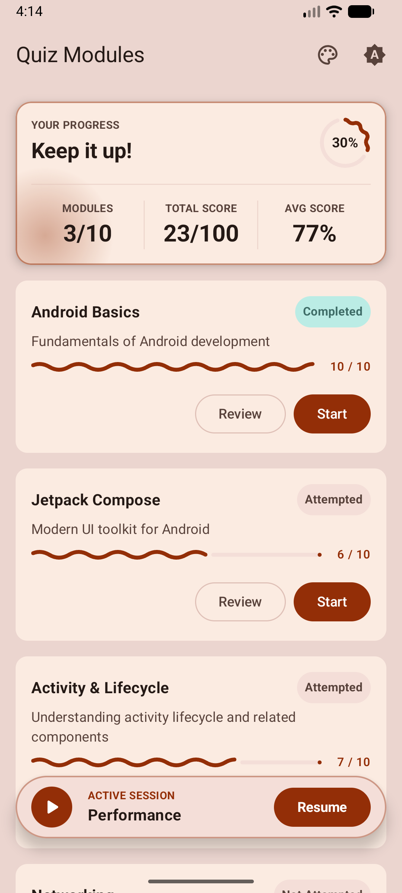
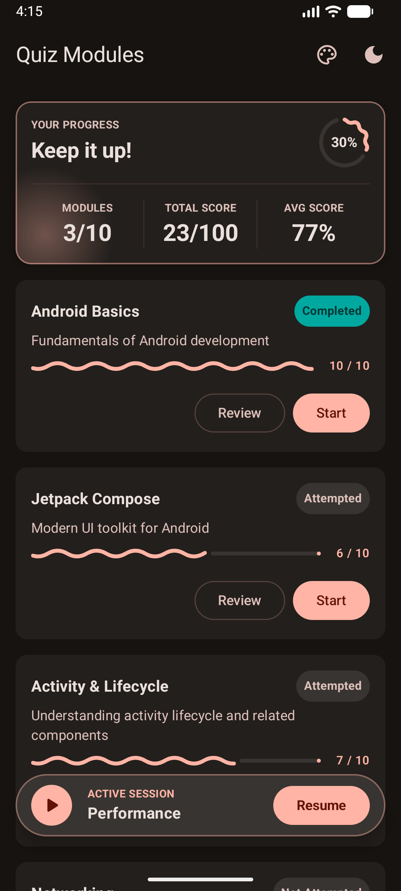
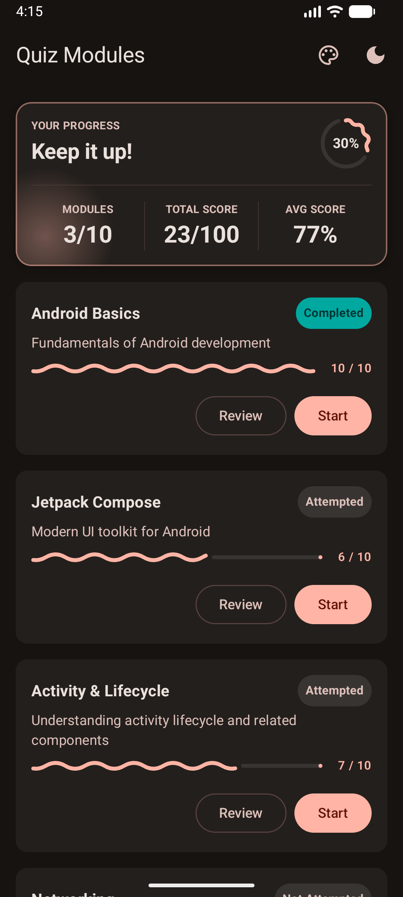

# QuizFlow

A polished, single-player **multiple-choice quiz** app built with modern Android engineering standards (**R1 Quiz Flow Upgrade**). QuizFlow loads questions from remote JSON gists, supports multiple quiz modules (*Android Basics*, *Jetpack Compose*, *Activity & Lifecycle*, *Networking*, *Background Tasks*, *UI/UX Patterns*, *Testing*, *Security*, *Performance*, *Architecture*), provides offline-first Room persistence, and runs an animated quiz flow with answer reveal, streak tracking, interactive results, and session restoration.

Built to scale — **Clean Architecture + MVVM + Repository pattern**, a **pure-Kotlin domain layer**, **feature-sliced packages**, **Material 3 Expressive** theming with dynamic color, and a broad test suite (**164 unit test methods** across domain, data, ViewModel, Room DAOs, and Compose UI, plus on-device instrumented tests for real touch/gesture input).

**📦 Want to try it without building?** Download the APK from the
**[Releases](https://github.com/ShanuDevCodes/QuizFlow/releases/latest)** page and install it on
an Android 10+ device.

---

## 📸 Screenshots

| Loading (shimmer) | Question View | Answer Revealed |
|---|---|---|
|  |  |  |

| Streak Badge Lit | Results & High Score | Light / Dark Theme |
|---|---|---|
|  |  |  |

| Module List (Light Theme) | Module List (Dark Theme) | Module List (Not Started) |
|---|---|---|
|  |  |  |

## 🎬 Full walkthrough video

A full end-to-end screen recording of the app (module list → answer/skip through all 10 → streak →
results → quick resume → restart, plus the theme/dynamic-color toggles) is available here:

**▶️ [Watch the demo video](https://drive.google.com/file/d/1cBz3tsqXz92IN6j3rwhOivIosvmIUHPf/view?usp=sharing)**

---

## ✨ Features

- **Module List & Subject Selection** — Select from multiple quiz topics (*Android Basics*, *Jetpack Compose*, *Activity & Lifecycle*, *Networking*, *Background Tasks*, *UI/UX Patterns*, *Testing*, *Security*, *Performance*, *Architecture*) with live progress badges (**"Start"** for un-started, **"Resume"** for active session, **"Review"** for completed), question counts, and high scores.
- **Overall Progress Summary Card** — Live dashboard displaying total completion %, count of completed modules, total cumulative score, and average score across all subjects.
- **Quick Resume Bar** — Floating animated bottom bar when a quiz session is in-progress, allowing immediate 1-tap resumption from anywhere on the module list screen.
- **Offline-First Room Persistence** — Fully reactive local database (`QuizFlowDatabase`, `SubjectDao`, `QuestionDao`, `ModuleProgressDao`, `QuizSessionStateDao`). Fetches remote subject & question Gists over Retrofit/OkHttp when online and caches them locally into Room; seamlessly operates offline with zero brief error flashes.
- **Resilient Gist Network Sync** — Custom OkHttp `jsonSanitizerInterceptor` strips malformed trailing commas from Gist JSON responses, and `QuestionDto` uses flexible `JsonElement` parsing for raw integers inside option arrays.
- **Quiz Flow** — Question text + 4 options, a **segmented per-question progress bar**, tap to reveal the correct answer and your selection (color **and** icon, not color alone), then a 1-second reveal before auto-advancing.
- **Skip** — Advances immediately with no reveal; also triggerable by **swiping left**.
- **Streak Tracking** — A badge **lights up at 3 correct in a row** with a Lottie confetti micro-interaction; any wrong answer resets the streak.
- **Results** — Correct/Total, longest streak, and skipped count in a stat card with staggered reveal animations, high-score tracking, and celebratory confetti + trophy on scores ≥ 80%.
- **Restart** — Resets all counters and returns to question 1.
- **100% Stateless Composable UI Architecture** — Strict separation between stateful route screens (`ModuleListRouteScreen`, `QuizRouteScreen`, `ResultsRouteScreen`) holding ViewModels and **100% stateless UI composables** (`ModuleListScreen`, `QuizScreen`, `ResultsScreen`, `ModuleCard`, `OverallProgressCard`, `QuickResumeBar`, `OptionCard`, `QuestionProgressBar`, `StreakBadge`, `SkipButton`, `QuizFlowTopBar`).
- **Centralized Compose Multi-Previews** — Unified `@ComponentPreviews` annotation providing Light and Dark mode side-by-side IDE previews wrapped in `QuizFlowPreview`.
- **Theming** — Material 3 Expressive with a persisted **Light / Dark / System** toggle and a separate **dynamic (wallpaper) color** toggle on Android 12+, both DataStore-backed.
- **Accessibility** — Semantic roles, state-specific content descriptions, a **polite live region** announcing correct/wrong on reveal, and edge-to-edge system-bar handling that tracks the theme.

---

## 🏗️ Architecture

Clean Architecture + MVVM + Repository pattern, **feature-sliced by package** inside a single
Gradle module (`:app`). See `docs/work/PRD.md` §5 for the full rationale.

```
com.shanu.quizflow
├── QuizFlowApplication.kt          @HiltAndroidApp
├── MainActivity.kt                 @AndroidEntryPoint; splash, edge-to-edge, hosts the Compose tree
├── core/                           cross-cutting infrastructure shared by every feature
│   ├── database/                   Room Database (QuizFlowDatabase, entities, DAOs)
│   ├── di/                         Hilt modules (network, database, dispatchers, DataStore, settings)
│   ├── network/                    Retrofit / OkHttp / jsonSanitizerInterceptor / kotlinx.serialization providers
│   ├── result/                     DataResult<T> (Success/Error) + AppError — the repo result wrapper
│   ├── coroutines/                 DispatcherProvider (injectable; swapped for TestDispatchers in tests)
│   ├── settings/                   theme + dynamic-color preference feature (domain/data/presentation)
│   └── ui/
│       ├── theme/                  ComponentPreviews (@ComponentPreviews), Color, Type, Dimens, Theme (Material3 Expressive)
│       └── components/             shared composables (QuizFlowTopBar, StreakBadge, SkipButton, ShimmerEffect, etc.)
└── feature/quiz/
    ├── data/                       local (Room DAOs) + remote data sources, repository impls, DTO↔entity↔domain mappers
    ├── domain/                     pure Kotlin: Subject/Question/ModuleProgress/QuizSession models, use cases, repo interfaces
    └── presentation/               Route Screens (ViewModels) + Stateless Screens & Components
        ├── modulelist/             ModuleListRouteScreen, ModuleListScreen, ModuleCard, OverallProgressCard, QuickResumeBar
        ├── quiz/                   QuizRouteScreen, QuizScreen, OptionCard, QuestionProgressBar
        ├── results/                ResultsRouteScreen, ResultsScreen
        └── navigation/             QuizFlowHost (Navigation 3 NavDisplay)
```

### Layer rule

```
presentation ──▶ domain ◀── data
```

- **`domain` is pure Kotlin** — zero Android / Compose / Retrofit imports. This is what makes the
  streak/scoring/session logic trivially unit-testable without Robolectric.
- **`data`** implements the domain `QuizRepository` interface and owns DTOs, Room DAOs, entities, the API, and mappers.
- **`presentation`** depends only on `domain`. **ViewModels never touch a repository directly** —
  always through a use case (a standing convention for every feature).
- **DI (`core/di`, feature `di/`)** is the only place that knows all three layers.

### Key flows

- **State** — `QuizViewModel` owns an immutable `QuizSession` (single source of truth) and projects
  it into a `QuizUiState` sealed interface (`Loading` / `Error` / `Question` / `Finished`).
  Each user action runs a pure use case that returns a new session copy.
- **Reveal / auto-advance** — answering emits a `REVEALING` state and launches a *cancelable*
  coroutine that waits the injected reveal duration, then advances. Skipping cancels it and
  advances immediately.
- **Navigation** — Jetpack **Navigation 3** (`NavDisplay`) with a `ModuleList → Quiz → Results` back
  stack. Stateful route composables host ViewModels while child composables remain 100% stateless.

---

## 🧰 Tech stack

| Concern | Choice |
|---|---|
| Language / UI | Kotlin 2.2.10, Jetpack Compose (BOM `2026.06.01`), **Material 3 Expressive** |
| Architecture | Clean Architecture, MVVM, Repository, use-case-mediated ViewModels |
| Async | Coroutines + Flow 1.10.2 (`StateFlow` for UI state, Kotlin `Duration` API) |
| Persistence / DB | **Room 2.7.1** (`QuizFlowDatabase`, DAOs, Entities) + DataStore Preferences 1.1.7 |
| DI | Hilt 2.59.2 (KSP 2.3.6) |
| Networking | Retrofit 3.0.0 + OkHttp 5.1.0 + kotlinx.serialization 1.9.0 (JSON + custom `jsonSanitizerInterceptor`) |
| Navigation | Jetpack Navigation 3 (1.1.4) |
| Animation | Compose animation APIs + Lottie 6.7.1 |
| Build | AGP 9.3.0, `compileSdk 37`, `minSdk 29`, `targetSdk 36`, JVM 17, **R8 on for release** |
| Testing | JUnit 4.13.2, coroutines-test 1.10.2, Turbine 1.2.1, MockK 1.14.4 (fakes-first), Truth 1.4.4, Robolectric 4.16.1, Compose UI Test, Jacoco 0.8.13 |

> **Note — bleeding-edge stack.** This project runs AGP 9.3, an **alpha** Compose BOM
> (`2026.06.01`, required for Material 3 Expressive), and recent Hilt/KSP. `compileSdk` is bumped
> to 37 to satisfy the alpha BOM. The specific compatibility issues hit and fixed are documented in
> `docs/work/PRD.md` §14 — verify changes with a real `./gradlew assembleDebug` rather than trusting
> version research alone.

---

## 🚀 Build & run

Requirements: Android Studio (AGP 9.3+), JDK 17+. From the repo root, use the Gradle **wrapper**
(never a system-installed `gradle`):

```bash
./gradlew assembleDebug         # build the debug APK
./gradlew assembleRelease       # build the release APK (R8/minify enabled)
./gradlew installDebug          # install debug on a connected device/emulator
adb shell am start -n com.shanu.quizflow/.MainActivity
```

There is no CLI "run" outside Android Studio — use `installDebug` + `adb`, or run from the IDE.

---

## ✅ Tests & coverage

```bash
./gradlew testDebugUnitTest     # unit + Robolectric Compose UI tests (app/src/test)
./gradlew lintDebug             # Android lint
./gradlew jacocoTestReport      # coverage → app/build/reports/jacoco/jacocoTestReport/html/index.html
./gradlew connectedAndroidTest  # instrumented tests (needs an emulator/device)
```

Run a single class:

```bash
./gradlew testDebugUnitTest --tests "com.shanu.quizflow.feature.quiz.presentation.modulelist.ModuleListViewModelTest"
```

**What's tested** (fakes-first; MockK only where a fake is impractical):

| Layer | What's covered |
|---|---|
| **Domain** (models, use cases, session/streak/scoring logic) | Correct/wrong/skip transitions, streak reset & longest-streak preservation, restart, result tallies, module progress & session restoration |
| **Data** (mapper, DTO serialization, Room DAOs, repository, remote API) | Valid + malformed JSON, trailing comma sanitization, network↔Room DB offline caching, error propagation |
| **Presentation** (`ModuleListViewModel`, `QuizViewModel`, `ResultsViewModel`) | Load success/error/retry, offline state handling, reveal → virtual-advance → next, skip cancels auto-advance, streak flag, finish & restart |
| **UI** (Compose via Robolectric, plus on-device instrumented tests) | Every screen + shared component: ModuleList, Question render + tap/reveal/skip, progress bar segments, option states, streak badge, results stat rows, top bar + theme/dynamic-color toggles |

**Coverage** — run `./gradlew jacocoTestReport` and open
`app/build/reports/jacoco/jacocoTestReport/html/index.html` for current numbers. Domain (models/use cases) and mappers are exercised exhaustively by design; ViewModels and every screen/component have direct unit & Robolectric tests (**164 tests total**).

### Continuous integration

`.github/workflows/ci.yml` runs on every PR and on push to `master`:
`testDebugUnitTest` + `lintDebug` + `assembleDebug`, with `assembleRelease` (R8) as a release gate.
All unit/Robolectric tests are part of the `testDebugUnitTest` gate, so the CI run is the source of
truth for "the tests pass."

---

## 🧭 Design decisions & assumptions

- **JSON source** — the raw gists (`gist.githubusercontent.com/dr-samrat/…/raw`). Retrofit + OkHttp with custom `jsonSanitizerInterceptor` fetches subjects and questions, handles malformed trailing commas automatically, and stores them in Room local DB for seamless offline support.
- **Reveal timing** — the correct/wrong state shows for **1 second** (the progress-bar segment
  fills over exactly that second) before auto-advancing. The spec suggested 2 s; the shorter,
  progress-synced timing was a deliberate UX choice.
- **Does skip break the streak?** — yes. Streak = *consecutive correct*; a skip is neither correct
  nor wrong, increments the skipped count, and resets the current streak to 0.
- **Correct/Total** — Total is 10 questions per module; skipped is reported separately.
- **Streak badge** lights at **3+** consecutive correct; **celebration** (trophy + confetti)
  triggers at a score **≥ 80%**.
- **State Hoisting** — Only stateful route composables (`ModuleListRouteScreen`, `QuizRouteScreen`, `ResultsRouteScreen`) hold ViewModels. All screen layouts and child UI components are 100% stateless.
- **Theming** — every Material 3 color role is defined explicitly for light ("QuizFlow Expressive")
  and dark ("Earth & Ether"); dynamic wallpaper color is an independent, persisted, user toggle
  (Android 12+).
- **R8** is enabled for release; keep rules live in `app/src/main/keepRules/*.keep`.

### Known limitations (documented, not accidental)

- **Process death** mid-quiz restores question index, correct/skipped counts, and streaks via `SavedStateHandle` and Room DB `QuizSessionStateDao`.
- **Swipe** is one-directional (left-to-skip only); there is no "go back to a previous question"
  gesture.

---

## 📂 Project docs

- **[`docs/work/PRD_v2.md`](docs/work/PRD_v2.md)** — authoritative specification for R1 Quiz Upgrade (PRDv2).
- **[`docs/R1_ASSIGNMENT_UPGRADE.md`](docs/R1_ASSIGNMENT_UPGRADE.md)** — full R1 assignment upgrade architecture and changelog.
- **[`docs/work/PRD.md`](docs/work/PRD.md)** — initial product requirements & implementation spec.
