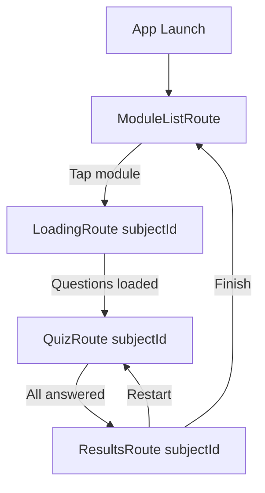

# QuizFlow — PRD v2: R1 Quiz Upgrade

## 1. Overview

**Objective:** Upgrade QuizFlow from a single-quiz app to a multi-module quiz app with offline-first architecture, local persistence of progress/scores, and responsive UI across all form factors.

**Assignment Source:** R1 - Quiz Upgrade (3-hour take-home)

**Constraints:**
- Maintain strict Clean Architecture + Repository + MVVM
- ViewModels must only interact with domain through UseCases — never inject repositories directly
- Domain layer stays pure Kotlin — no Android, Compose, or Retrofit imports
- Preserve all existing R0 quiz features (10 questions, skip-advances, streak badge, swipe-to-skip, staggered reveal, Lottie celebrations)
- Offline-first: Room DB is the single source of truth; network is a sync mechanism

---

## 2. New API Structure

### 2.1 Categories/Modules Endpoint
```
GET https://gist.githubusercontent.com/dr-samrat/ee986f16da9d8303c1acfd364ece22c5/raw
```
Returns: `List<SubjectDto>`
```json
{
  "id": "android_basics",
  "title": "Android Basics",
  "description": "Fundamentals of Android development",
  "questions_url": "https://gist.githubusercontent.com/...android_basics.json"
}
```

### 2.2 Per-Module Questions Endpoint
```
GET <questions_url from SubjectDto>
```
Returns: `List<QuestionDto>` (same schema as R0)
```json
{
  "id": 1,
  "question": "...",
  "options": ["A", "B", "C", "D"],
  "correctOptionIndex": 0
}
```

---

## 3. Functional Requirements

### FR1 — Module List Screen (Start Screen)
- On app launch, display a scrollable list of all modules
- Each module card shows:
  1. **Module Title** (e.g., "Android Basics")
  2. **Module Description** (e.g., "Fundamentals of Android development")
  3. **Status Button**: "Start" if never taken, "Review" if completed
  4. **Progress Summary**: `"X Questions | Score: Y/10"` format
  5. **High Score** display when available
- First launch: fetch subjects from network → cache to Room → display from Room
- Subsequent launches: display from Room immediately, optionally sync in background
- Pull-to-refresh to manually trigger network sync

### FR2 — Module-Scoped Quiz Flow
- Tapping a module navigates to the quiz loading screen for that specific module
- Quiz behavior identical to R0 (10 questions, skip-advances, streak badge, swipe-to-skip, 1s reveal, staggered option reveal)
- Questions fetched: Room first → network fallback → cache fetched questions to Room
- Quiz scoped strictly to the selected module's questions

### FR3 — Updated Results Screen
- Keep all existing stats (correct/total, longest streak, skipped)
- Add a **"Finish"** button that:
  1. Saves completion status to Room DB (marks module as completed)
  2. Saves the score (correct count / total)
  3. Updates high score if current score exceeds previous best
  4. Navigates back to Module List Screen
- Keep existing "Restart Quiz" button (re-runs the same module)

### FR4 — Local Persistence (Room DB)
- **Offline-first**: Room DB is the single source of truth
- Persist:
  - All subjects/modules with metadata
  - All questions per module (foreign-keyed to subject)
  - Module completion status
  - Most recent score per module
  - Highest score per module
  - In-progress quiz session state (current question index, answers so far)
- App relaunch restores last-known state for every module

### FR5 — Responsive UI
- Fix landscape orientation handling: all screens must be usable in landscape
- Fix small/zoomed screens: content must scroll when it doesn't fit
- Ensure proper edge-to-edge compliance with IME and system bars
- Test scenarios: portrait, landscape, small phone, large tablet, accessibility zoom

---

## 4. Database Schema

### 4.1 `subjects` Table
| Column | Type | Notes |
|---|---|---|
| `id` | TEXT | PK, from API (e.g., "android_basics") |
| `title` | TEXT | NOT NULL |
| `description` | TEXT | NOT NULL |
| `questions_url` | TEXT | NOT NULL, URL to fetch questions |
| `display_order` | INTEGER | NOT NULL, preserves API ordering |

### 4.2 `questions` Table
| Column | Type | Notes |
|---|---|---|
| `id` | INTEGER | Composite PK with subject_id |
| `subject_id` | TEXT | FK → subjects.id, Composite PK |
| `question_text` | TEXT | NOT NULL |
| `option_0` | TEXT | NOT NULL |
| `option_1` | TEXT | NOT NULL |
| `option_2` | TEXT | NOT NULL |
| `option_3` | TEXT | NOT NULL |
| `correct_option_index` | INTEGER | NOT NULL |

### 4.3 `module_progress` Table
| Column | Type | Notes |
|---|---|---|
| `subject_id` | TEXT | PK, FK → subjects.id |
| `is_completed` | INTEGER | Boolean (0/1) |
| `last_score` | INTEGER | Most recent quiz score (correct count) |
| `high_score` | INTEGER | All-time best score |
| `total_questions` | INTEGER | Number of questions in the module |
| `last_attempted_at` | INTEGER | Epoch millis timestamp |

### 4.4 `quiz_session_state` Table (for in-progress restoration)
| Column | Type | Notes |
|---|---|---|
| `subject_id` | TEXT | PK, FK → subjects.id |
| `current_index` | INTEGER | NOT NULL |
| `correct_count` | INTEGER | NOT NULL |
| `skipped_count` | INTEGER | NOT NULL |
| `current_streak` | INTEGER | NOT NULL |
| `longest_streak` | INTEGER | NOT NULL |

> [!NOTE]
> The `quiz_session_state` row is deleted when a quiz is finished (Finish pressed) and created/updated during an active quiz. On relaunch, if a row exists for a module, it means there's an in-progress session.

---

## 5. Architecture Changes

### 5.1 Package Structure (additions in **bold**)

```
com.shanu.quizflow
├── QuizFlowApplication.kt
├── MainActivity.kt
├── core/
│   ├── coroutines/
│   ├── di/
│   │   ├── DispatchersModule.kt
│   │   ├── SettingsModule.kt
│   │   └── **DatabaseModule.kt**          ← NEW: Room DB provider
│   ├── network/
│   ├── result/
│   ├── settings/
│   ├── **database/**                      ← NEW: Room database class
│   │   └── **QuizFlowDatabase.kt**
│   └── ui/
│       ├── theme/
│       └── components/
└── feature/quiz/
    ├── data/
    │   ├── di/
    │   │   ├── QuizApiModule.kt           ← MODIFIED: add new API endpoints
    │   │   └── QuizRepositoryModule.kt    ← MODIFIED: bind new repos/data sources
    │   ├── local/
    │   │   ├── QuizAssetDataSource.kt     ← KEEP (fallback)
    │   │   ├── **dao/**                   ← NEW
    │   │   │   ├── **SubjectDao.kt**
    │   │   │   ├── **QuestionDao.kt**
    │   │   │   └── **ModuleProgressDao.kt**
    │   │   └── **entity/**                ← NEW
    │   │       ├── **SubjectEntity.kt**
    │   │       ├── **QuestionEntity.kt**
    │   │       ├── **ModuleProgressEntity.kt**
    │   │       └── **QuizSessionStateEntity.kt**
    │   ├── mapper/
    │   │   ├── QuestionMapper.kt          ← MODIFIED: add subject-aware mapping
    │   │   └── **SubjectMapper.kt**       ← NEW
    │   ├── remote/
    │   │   ├── QuizApi.kt                 ← MODIFIED: add getSubjects(), getQuestionsByUrl()
    │   │   ├── QuizRemoteDataSource.kt    ← MODIFIED: add subject/question fetching
    │   │   └── dto/
    │   │       ├── QuestionDto.kt         ← KEEP
    │   │       └── **SubjectDto.kt**      ← NEW
    │   └── repository/
    │       ├── QuizRepositoryImpl.kt      ← MODIFIED: offline-first with Room
    │       └── **ModuleProgressRepositoryImpl.kt** ← NEW
    ├── domain/
    │   ├── model/
    │   │   ├── Question.kt                ← MODIFIED: add subjectId field
    │   │   ├── QuizSession.kt             ← KEEP
    │   │   ├── QuizResult.kt              ← KEEP
    │   │   ├── AnswerRecord.kt            ← KEEP
    │   │   ├── **Subject.kt**             ← NEW: domain model
    │   │   ├── **ModuleProgress.kt**      ← NEW: domain model
    │   │   └── **ModuleStatus.kt**        ← NEW: NOT_STARTED / IN_PROGRESS / COMPLETED
    │   ├── repository/
    │   │   ├── QuizRepository.kt          ← MODIFIED: add subject-aware methods
    │   │   └── **ModuleProgressRepository.kt** ← NEW
    │   └── usecase/
    │       ├── GetQuestionsUseCase.kt     ← MODIFIED: takes subjectId parameter
    │       ├── AnswerQuestionUseCase.kt   ← KEEP
    │       ├── SkipQuestionUseCase.kt     ← KEEP
    │       ├── AdvanceQuizUseCase.kt      ← KEEP
    │       ├── RestartQuizUseCase.kt      ← KEEP
    │       ├── **GetSubjectsUseCase.kt**  ← NEW
    │       ├── **SyncSubjectsUseCase.kt** ← NEW
    │       ├── **SaveModuleResultUseCase.kt** ← NEW
    │       ├── **GetModuleProgressUseCase.kt** ← NEW
    │       └── **SaveSessionStateUseCase.kt** ← NEW
    └── presentation/
        ├── di/
        ├── navigation/
        │   ├── QuizFlowHost.kt            ← MODIFIED: new flow with ModuleList
        │   └── Routes.kt                  ← MODIFIED: add ModuleListRoute, QuizRoute(subjectId)
        ├── **modulelist/**                ← NEW feature screen
        │   ├── **ModuleListRoute.kt**
        │   ├── **ModuleListScreen.kt**
        │   ├── **ModuleListViewModel.kt**
        │   ├── **ModuleListUiState.kt**
        │   └── **ModuleCard.kt**
        ├── loading/                       ← MODIFIED: now module-specific
        │   ├── LoadingRoute.kt
        │   ├── LoadingScreen.kt
        │   └── QuizSkeleton.kt
        ├── quiz/                          ← MODIFIED: receives subjectId
        │   └── (existing files, with modifications)
        └── results/                       ← MODIFIED: add Finish button
            ├── ResultsRoute.kt
            └── ResultsScreen.kt
```

### 5.2 Navigation Flow



### 5.3 Data Flow (Offline-First)

```
                    ┌──────────────┐
                    │   Network    │
                    │  (Retrofit)  │
                    └──────┬───────┘
                           │ sync
                    ┌──────▼───────┐
                    │   Room DB    │  ← Single Source of Truth
                    │ (subjects,   │
                    │  questions,  │
                    │  progress)   │
                    └──────┬───────┘
                           │ observe/query
                    ┌──────▼───────┐
                    │  Repository  │
                    └──────┬───────┘
                           │
                    ┌──────▼───────┐
                    │   UseCases   │
                    └──────┬───────┘
                           │
                    ┌──────▼───────┐
                    │  ViewModel   │
                    └──────┬───────┘
                           │
                    ┌──────▼───────┐
                    │ Compose UI   │
                    └──────────────┘
```

---

## 6. Responsive UI Fixes

### 6.1 Landscape Support
- Wrap quiz screen content in `verticalScroll` when in landscape
- Ensure option cards don't overflow
- Results screen should scroll in landscape

### 6.2 Small/Zoomed Screens
- Module list: already uses `LazyColumn` — OK
- Quiz screen: wrap content column in `verticalScroll` modifier
- Results screen: wrap content in `verticalScroll`
- Loading screen: already minimal — OK

### 6.3 Key Changes
- Add `verticalScroll(rememberScrollState())` to QuizScreen and ResultsScreen content columns
- Ensure `Arrangement.Bottom` skip button doesn't get cut off on small screens — move into scrollable area or use `Spacer(Modifier.weight(1f))` pattern
- Test with `fontScale = 2.0` in preview annotations

---

## 7. Implementation Phases

### Phase 1: Core Infrastructure
1. Add Room dependency to version catalog + build.gradle.kts
2. Create Room entities, DAOs, and database class
3. Create `DatabaseModule` for Hilt DI

### Phase 2: Data Layer
1. Create `SubjectDto` and update `QuizApi` with new endpoints
2. Create entity ↔ domain mappers
3. Update `QuizRepositoryImpl` for offline-first flow
4. Create `ModuleProgressRepositoryImpl`

### Phase 3: Domain Layer
1. Create new domain models: `Subject`, `ModuleProgress`, `ModuleStatus`
2. Create new use cases: `GetSubjectsUseCase`, `SyncSubjectsUseCase`, `SaveModuleResultUseCase`, etc.
3. Modify `GetQuestionsUseCase` to accept `subjectId`

### Phase 4: Presentation Layer
1. Create `ModuleListScreen` + `ModuleListViewModel`
2. Update navigation: new routes, new flow
3. Update `QuizViewModel` to be module-aware
4. Update `ResultsScreen` with Finish button + back-to-list navigation
5. Fix responsive UI (scroll modifiers)

### Phase 5: Polish
1. Update `CLAUDE.md` and `README.md`
2. Update string resources
3. Clean up unused code
4. Verify build succeeds

---

## 8. Key Design Decisions

| Decision | Rationale |
|---|---|
| Room for persistence over DataStore | Need relational data (FK between subjects → questions), complex queries (filter by subject, aggregate scores) |
| Composite PK (id + subject_id) for questions | Question IDs are only unique within a module (id=1 exists in every module) |
| Separate `module_progress` table | Clean separation of concerns; progress data is independent of quiz content |
| `quiz_session_state` table | Lightweight session restoration; row deleted on completion |
| `display_order` column on subjects | Preserve the API's ordering without relying on insertion order |
| Keep `QuizAssetDataSource` | Backwards compatibility for extreme offline scenarios; can serve as emergency fallback |
